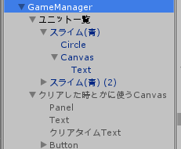

# 自分のための備忘録

# ユニット

ユニット Unit.cs, Slime.cs, BoxCollider  
└攻撃範囲 RangeCircle.cs  
となっていて Unitクラスに攻撃力・HP・死んだ時手に入るお金などが記載されている  
個々の攻撃（この場合はスライム）についてはSlimeクラスが担当  
子のRangeCircleに必要な情報を渡すと一定間隔で範囲内の敵を攻撃してくれる  

Slime.Start  
↓  
RangeCircle.Init  
↓  
RangeCircle.Update（攻撃） ← Unit.Damage（攻撃力）  

Slime.Update（移動）  

# ゲームマネージャ
クリアを管理  

- 自拠点・敵拠点のUnitオブジェクト
- プレイ時間

を保持  
どちらかの拠点が破壊されれば子に持っているUnitたちを停止させ（isStop = true)対応したCanvasを表示する

# TODO
- [x] HP表示
- 拠点
- ゲームクリア
- ゲームオーバー
- ユニット購入
